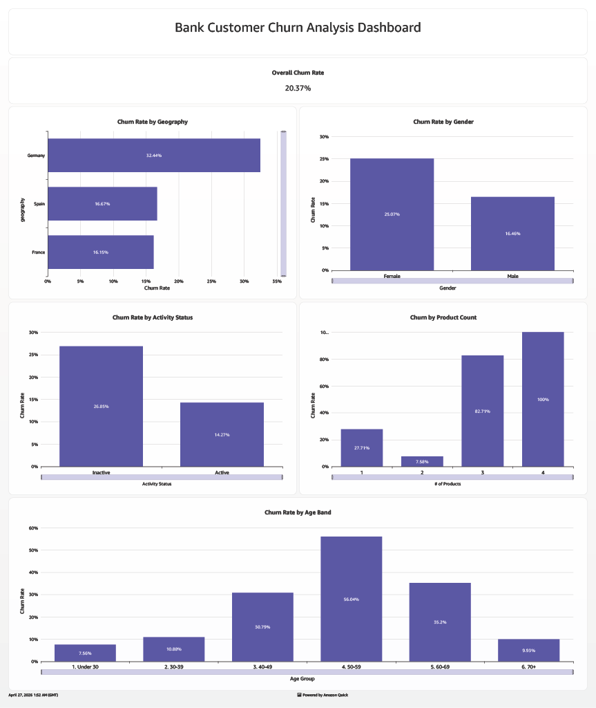

# Bank Customer Churn Analysis

An end-to-end data analytics project analyzing customer churn patterns at a European bank using the AWS analytics stack.

## Dashboard



## Tools & Architecture

S3 → Glue → Athena → QuickSight

- **AWS S3** – Raw data storage
- **AWS Glue** – Crawler for automated schema detection and cataloging
- **AWS Athena** – SQL analysis on top of the Glue data catalog
- **AWS QuickSight** – Interactive dashboard and visualization

## Dataset

Kaggle Bank Customer Churn dataset — 10,000 customers across France, Spain, and Germany.

## Key Findings

1. **Overall churn rate: 20.37%** across 10,000 customers
2. **Germany is the highest-risk market** at 32.44% — double France and Spain (~16%)
3. **2-product customers are the most loyal** (7.58% churn); 3-4 product customers churn at extreme rates (82–100%)
4. **Customers aged 50-59 churn at 56%** — the single highest-risk segment
5. **Inactive members account for the majority of total churn** (1,302 vs 735) despite being the smaller group
6. **High-balance customers (100k+) churn at 59% higher rates** — the most valuable customers are most at risk
7. **Female customers churn at 52% higher rate** than male customers (25.07% vs 16.46%)
8. **Credit score has no meaningful correlation with churn**

## Repository Structure

```
├── athena/
│   └── queries.sql        # All SQL queries run in Athena
├── data/
│   └── Churn_Modelling.csv
├── docs/
│   ├── analysis.md        # Full query results and findings
│   └── data_validation.md
├── logs/
│   └── project_log.md
├── quicksight/
│   └── dashboard.pdf
```
